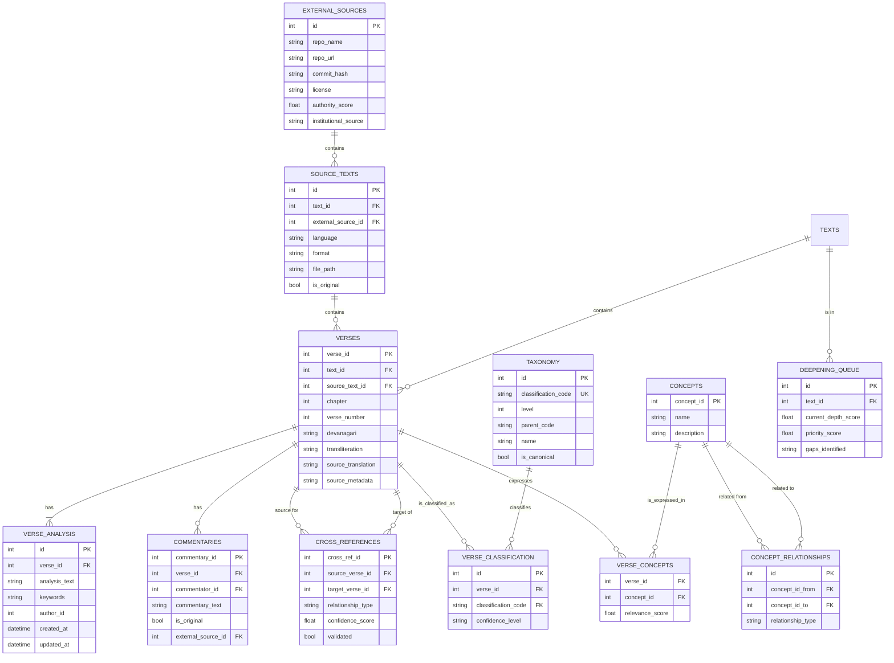
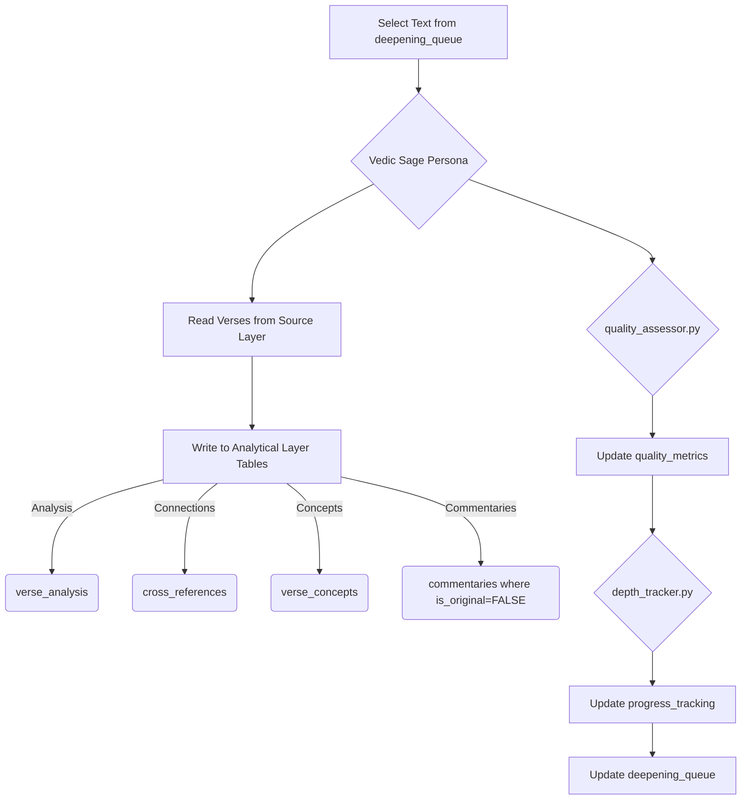
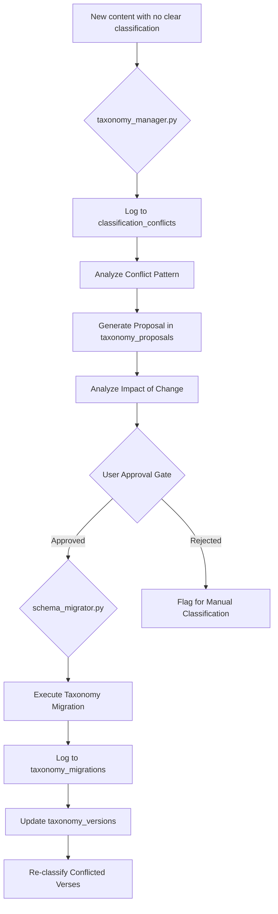

> **Note**: This is a living document and will be updated as the system evolves. See the `taxonomy_versions` table for a complete history of schema changes.

---

## 1. Introduction

### 1.1. Purpose

This document outlines the complete technical architecture of the Vedic Mastery Study knowledge base. Its purpose is to provide a single source of truth for the database schema, data flows, and operational logic, ensuring project continuity and enabling future development.

### 1.2. Architectural Principles

The system is designed around the following core principles:

1.  **Source/Analytical Separation**: A strict, immutable separation between raw source texts (the *Source Layer*) and our interpretations, analyses, and cross-references (the *Analytical Layer*).
2.  **Granularity**: All knowledge is organized at the verse level, enabling deep, precise analysis and cross-referencing.
3.  **Provenance**: Every piece of data is traceable to its origin. We know where every verse, translation, and commentary came from.
4.  **Evolvability**: The system is designed to grow. A hierarchical taxonomy and a self-evolving database protocol allow for the integration of new texts and concepts without breaking the existing structure.
5.  **Scalability**: The architecture is designed to handle hundreds of thousands of verses, commentaries, and cross-references with optimized queries and indexing.
6.  **Quality Assurance**: Integrated quality assessment frameworks ensure the depth, accuracy, and completeness of our analytical work.

---

## 2. Database Schema (Version 2.0)

### 2.1. Overview

The database consists of **34 tables** organized into 7 logical groups. This structure supports the strict separation of the Source and Analytical Layers while providing robust systems for taxonomy, quality control, and operational tracking.

### 2.2. Entity-Relationship Diagram (ERD)



### 2.3. Table Groups & Detailed Schema

#### **Group 1: Core Text & Study Management (Existing, Modified)**

These tables form the original backbone of the project, cataloging the texts we study and our own analytical documents.

-   **`texts`**: The master catalog of all 111+ Vedic texts in our study framework.
    -   `classification_code` (TEXT, new): Foreign key to the `taxonomy` table.
-   **`study_documents`**: Links to our analytical Markdown files (e.g., deep dives, synthesis documents).
    -   `document_type` (TEXT, new): Categorizes the document ('analytical', 'synthesis', 'deep_dive', 'protocol').
-   **`categories`**: The 10 high-level breadth categories.
-   **`subcategories`**: Finer-grained categories within the main 10.

#### **Group 2: Source Layer (New & Modified)**

This layer is **immutable**. It stores the raw, word-for-word source material imported from external repositories.

-   **`external_sources`** (New): Catalogs the external GitHub repositories or websites we import from.
    -   `authority_score` (REAL): A 0-10 score indicating the source's authoritativeness.
    -   `institutional_source` (TEXT): The institution associated with the source (e.g., "IIT Kanpur").
-   **`source_texts`** (New): Represents a specific file or dataset within an external source (e.g., the Rigveda JSON file from DharmicData).
-   **`verses`** (Modified): The atomic unit of the knowledge base. Each row is a single verse.
    -   `source_text_id` (INTEGER, new): Foreign key to `source_texts`, linking the verse to its origin file.
    -   `devanagari` (TEXT, new): The verse text in pure Devanagari script.
    -   `transliteration` (TEXT): The verse text in IAST transliteration.
    -   `source_translation` (TEXT, new): The "default" or source-provided translation.
    -   `source_metadata` (TEXT, new): Any additional metadata from the source (e.g., chandas, rishi).
-   **`commentaries`** (Modified): Stores commentaries on specific verses.
    -   `is_original` (BOOLEAN, new): `TRUE` if the commentary is from the source, `FALSE` if it's our own synthesis.
    -   `external_source_id` (INTEGER, new): Links source commentaries to their origin.

#### **Group 3: Analytical Layer (New & Existing)**

This layer is **mutable**. It stores all of our intellectual output: interpretations, analyses, and connections.

-   **`verse_analysis`** (New): Our detailed, paragraph-level analysis and interpretation of a specific verse.
-   **`cross_references`** (Existing): Links one verse to another, defining the relationship (e.g., 'quotes', 'clarifies', 'contradicts').
-   **`concepts`** (Existing): A dictionary of all philosophical concepts (Brahman, Atman, etc.).
-   **`concept_relationships`** (New): Defines the ontology of concepts (e.g., "Moksha" `is_dependent_on` "Karma").
-   **`verse_concepts`** (Existing): A join table linking verses to the concepts they discuss.
-   **`synthesis_documents`** (New): Catalogs our high-level synthesis documents that span multiple texts.
-   **`synthesis_sources`** (New): Links a synthesis document back to every source verse that contributed to it.

#### **Group 4: Taxonomy System (New)**

This is our "Dewey Decimal System" for organizing all knowledge.

-   **`taxonomy`**: The master table for the 5-level hierarchical classification system (e.g., `2.111.001` for Brihadaranyaka 1.1.1).
-   **`verse_classification`**: A join table linking each verse to its specific code in the taxonomy.

#### **Group 5: Transformation & Evolution (New)**

These tables govern the self-evolving nature of the database.

-   **`classification_conflicts`**: Automatically logs verses that are difficult to classify.
-   **`taxonomy_proposals`**: Stores AI-generated proposals for new taxonomy branches.
-   **`taxonomy_migrations`**: Logs all schema migration scripts, including rollbacks.
-   **`taxonomy_versions`**: Provides version control for the taxonomy itself.

#### **Group 6: Quality & Progress Tracking (New & Existing)**

These tables help us measure our progress and ensure the quality of our work.

-   **`progress_tracking`** (Existing): Tracks breadth and depth scores for each text.
-   **`quality_metrics`** (New): Stores quality scores for our analysis on a per-verse basis.
-   **`deepening_queue`** (New): A prioritized to-do list of texts that require further deepening.
-   **`reading_progress`** (New): Tracks the Vedic Sage's reading status for every verse in the database ('unread', 'read', 'analyzed').

#### **Group 7: Logging & Provenance (New)**

These tables provide a complete audit trail.

-   **`import_decisions`**: Logs every import operation, including source, verses imported, and any conflicts.
-   **`classification_log`**: Logs every classification decision and any changes.
-   **`analysis_history`**: Tracks the history of changes to our `verse_analysis` entries.

---

## 3. Data Flow Diagrams

### 3.1. Data Import Flow

```mermaid
graph TD
    A[External Repo / Git Submodule] --> B{import_manager.py};
    B --> C[Parse Data (JSON, CSV)];
    C --> D{taxonomy_manager.py};
    D --> E{Auto-Classify};
    E -- Conflict --> F[Log to classification_conflicts];
    E -- Success --> G[Assign Classification Code];
    G --> H[Validate Data Quality];
    H --> I[Insert into Source Layer Tables];
    I --> J[Log to import_decisions];
    J --> K[Update reading_progress to 'unread'];
    K --> L[Add to deepening_queue];
```

**Flow Description**: The `import_manager.py` script reads from an external source, uses the `taxonomy_manager.py` to classify the content, validates it, and then inserts it into the immutable Source Layer tables. It finishes by logging the import and adding the new text to the deepening queue.

### 3.2. Knowledge Deepening Flow (Vedic Sage Workflow)



**Flow Description**: The Vedic Sage persona selects a text from the `deepening_queue`, reads from the read-only Source Layer, and writes all intellectual output (analysis, connections, etc.) to the mutable Analytical Layer tables. Quality and depth scores are then updated, and the text's priority in the queue is adjusted.

### 3.3. Taxonomy Evolution Flow



**Flow Description**: When unclassifiable content is found, the system logs a conflict, generates a proposal for a new taxonomy branch, and presents it to the user for approval. If approved, a safe, logged migration is performed to evolve the taxonomy without breaking existing data.

---

## 4. Conclusion

This architecture provides a robust, scalable, and evolvable foundation for the Vedic Mastery Study project. By strictly separating source data from our analysis and implementing comprehensive systems for taxonomy, quality, and provenance, we can ensure the long-term integrity and value of the knowledge base, paving the way for the future development of a Vedic AI/LLM.
