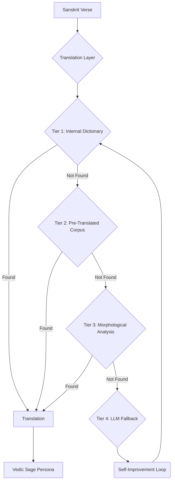

# TRANSLATION LAYER PROTOCOL

---

## 1.0 Architecture: A Multi-Tiered Approach

The Translation Layer is a service-oriented architecture designed to provide fast, accurate, and cost-effective translations of Sanskrit texts. It operates on a tiered query system, prioritizing internal, curated data over external, costly APIs.



## 2.0 Tiered Query Strategy

| Tier | Component | Description | Response Time | Cost |
| :--- | :--- | :--- | :--- | :--- |
| 1 | **Internal Dictionary** | Direct lookup in the `dictionary_entries` table (Monier-Williams, Apte, etc.). | < 50ms | Free |
| 2 | **Pre-Translated Corpus** | Search for the full verse in the `pre_translated_corpus` table (Itihasa dataset). | < 200ms | Free |
| 3 | **Morphological Analysis** | Deconstruct words using `word_stems` and `grammatical_rules` for programmatic translation. | < 500ms | Free |
| 4 | **LLM Fallback** | If all internal tiers fail, query a large language model (e.g., GPT-4) for a translation. | 1-5s | $$$ |

## 3.0 The Self-Improvement Loop

A core feature of the Translation Layer is its ability to learn and improve over time, reducing its reliance on the expensive Tier 4 fallback.

1.  **Flag for Review**: Any translation generated by the LLM (Tier 4) is automatically flagged in the database with a `needs_review` status.
2.  **Human-in-the-Loop**: A periodic review process allows a human expert to validate, correct, or reject the LLM-generated translation.
3.  **Enrich Knowledge Base**: Once a translation is validated, it is permanently added to the `dictionary_entries` or `pre_translated_corpus` table.
4.  **Reduce Future Costs**: The next time the same word or verse is requested, it will be resolved at Tier 1 or 2, avoiding the LLM call and its associated cost.

## 4.0 Integration Strategy

The Translation Layer is designed to be a plug-and-play service for any persona or script within the Vedic Mastery ecosystem.

-   **Primary Consumer**: The `VEDIC_SAGE_HYBRID_PERSONA_PROTOCOL` is the primary consumer, invoking the Translation Layer whenever it needs to understand a Sanskrit text.
-   **Service Provider**: The `LINGUISTICS_EXPERT_PERSONA_PROTOCOL` is the engine that powers the Translation Layer, executing the tiered query strategy.
-   **API**: The layer will expose a simple internal API:

    ```python
    def get_translation(sanskrit_text: str) -> dict:
        # Implements the Tiered Query Strategy
        pass
    ```

## 5.0 Benefits

-   **Cost Efficiency**: Drastically reduces API costs by prioritizing the free, internal knowledge base.
-   **Scholarly Rigor**: Ensures translations are based on authoritative, human-vetted dictionaries and corpora.
-   **Speed**: Delivers near-instantaneous translations for the vast majority of requests.
-   **Scalability**: The self-improvement loop allows the system to grow more intelligent and comprehensive with every query.
-   **Self-Sufficiency**: Reduces dependency on external, black-box APIs, creating a more robust and resilient system.

---
**Status**: Protocol defined. Ready for integration.
